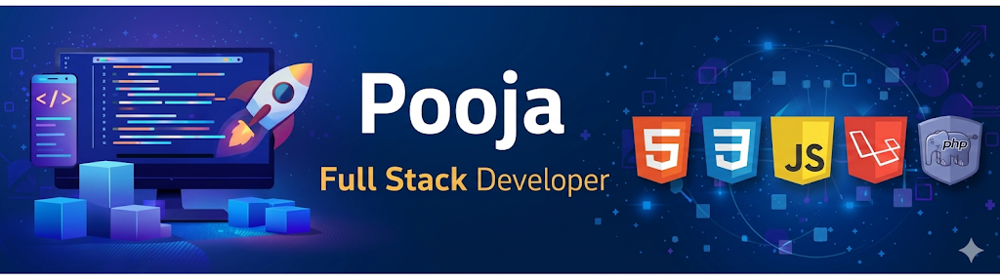

<h1 align="center">Hi 👋, I'm  Pooja Avadutha</h1>
<h3 align="center">Flutter Developer | Laravel Developer</h3>
 
 

  ✨ Building cross-platform mobile apps using Flutter  
  📚 Developing backend systems using Laravel  
  🎯 Interested in real-world application development

 

 
<!-- ===================== ABOUT ME ===================== -->
<h2 align="left">About Me</h2>
 

💻 Actively working on Flutter apps & Laravel backend projects  
🧠 Passionate about building scalable, user-friendly applications

 

 
<!-- ===================== TECH STACK ===================== -->
<h2 align="left">🚀 Technical Skills & Tools </h2>
 

<!-- Languages -->
<h4>Programming Languages</h4>

  
 
  <!-- Backend -->
<h4>Backend & APIs</h4>

    🔹 <b>RESTful APIs</b> &nbsp;&nbsp; 🔹 <b>JWT Authentication</b> &nbsp;&nbsp; 🔹 <b>MVC Architecture</b>

 
 
  <!-- Frontend / Mobile -->
<h4>Mobile App Development</h4>

<i>Cross-platform app development using Flutter</i>

 
 
  <!-- Databases -->
<h4>Databases</h4>

  
 
  <!-- Tools -->
<h4>Tools & Version Control</h4>

 

 
<!-- ===================== CONTACT ===================== -->
<h2 align="left">How to Reach Me</h2>
 

 
  
<!-- 
 
  
 -->

 

 
<!-- ===================== STATS ===================== -->
<h2 align="left">GitHub Stats</h2>
 

 

 
<!-- ===================== LEARNING ===================== -->
<h2 align="left">Currently Learning</h2>
 
<ul>
<li>Advanced Flutter UI & Animations</li>
<li>Laravel API Optimization</li>
<li>System Design Basics</li>
</ul>
 

 
<!-- ===================== COLLAB ===================== -->
<h2 align="left">Open to Collaborate</h2>
 

🤝 Open to Flutter & Laravel project collaborations  
📬 Feel free to reach out for teamwork and learning opportunities

 
<h2 align="left">🐍 Contribution Snake</h2>
 

